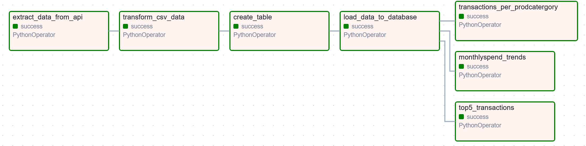

## Project Focus
This project simulates an ETL pipeline for a Data Engineer Technical Assessment. The goal of the assessment is to build an efficient pipeline that extracts, transforms, and loads customer transaction data into a MySQL database, making it available for analytics and insights.

An image of the ETL pipeline is shown below:



## Prerequisites
The following requirements are needed to run this project:
1. Ensure that python 3.10 or higher is installed in your machine. 
You can check your python version using:
```bash
python3 --version 
```
If python is not installed, run the following:
```bash
sudo apt update
sudo apt install python3 
```
2. You need MySQL installed and configured on to run database operations. 
To check if MySQL is installed run the following:
```bash
mysql --version 
```
If MySQL is not installed, run the following:
```bash
sudo apt update
sudo apt install mysql-server
```
After installing MySQL, you can log in to the MySQL shell using:
```bash
mysql -u root -p
```
Create a MySQL database (e.g., planet42) and a user (optional):
```bash
CREATE DATABASE planet42_assessment;
CREATE USER 'user'@'localhost' IDENTIFIED BY 'password';
GRANT ALL PRIVILEGES ON planet42 TO 'user'@'localhost';
FLUSH PRIVILEGES;
```
Note: The user, localhost and password can be changed to your preference.
Once the database secrets has been created, Add them to the ```.env`` file in the root directory.`
## Setup Instructions
1. Clone the repository:
```bash
cd /root
git git@github.com:Wamolambo/transaction_datapipeline.git
cd transaction_data_workflow
   ```
2.  Create a virtual environment:
```bash
python3 -m venv etl_env
source etl_env/bin/activate 
   ```
3.  Install dependencies:
```bash
pip install -r requirements.txt
```
4. Source setup script:
```bash
chmod +x run.sh
source airflow_setip.sh
``` 
Access the Airflow UI:
http://localhost:8080
Note: The default username and password are "admin" and "admin", respectively.
